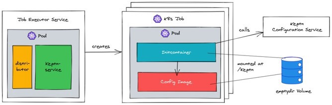
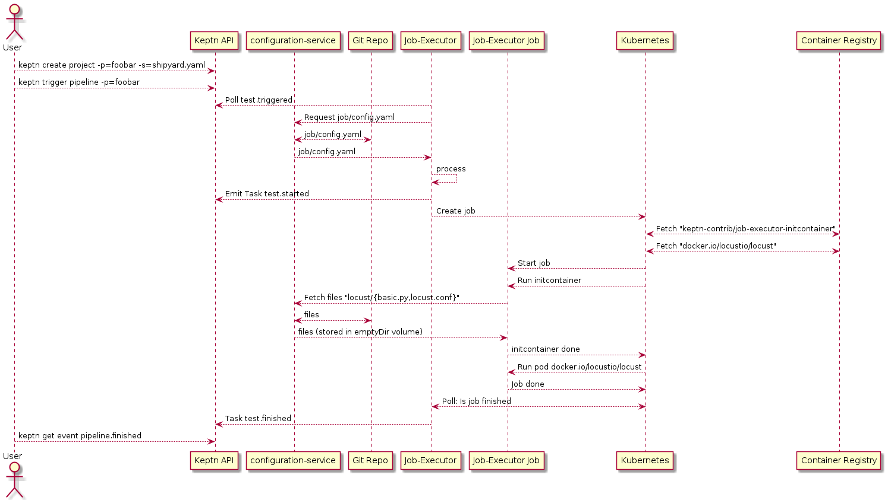
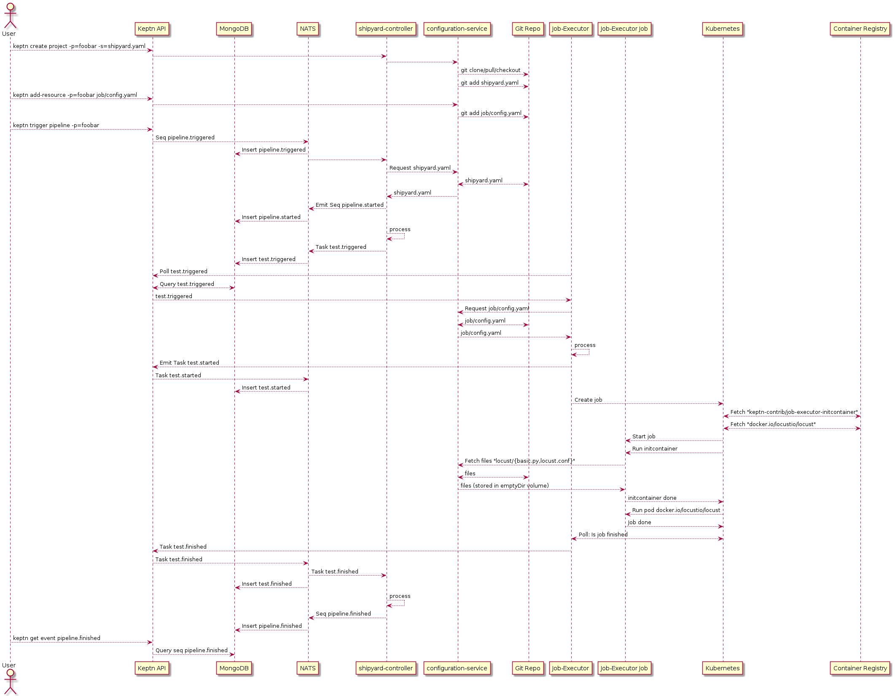

# Architecture

Within this document the architecture of job-executor-service is described.

## Basics

Before reading this document, we expect that you already have some knowledge about [Keptn](https://keptn.sh).
Primarily, you should be familiar with the following terms and concepts of Keptn:
* Project
* Service
* Shipyard file
* Stage
* Sequence
* Tasks
* Execution-plane vs. control-plane
* Job-executor-service basics

Suggested reads:
* https://keptn.sh/docs/concepts/glossary/
* https://keptn.sh/docs/concepts/delivery/
* https://keptn.sh/docs/concepts/architecture/
* https://engineering.dynatrace.com/blog/a-tool-to-execute-them-all-the-job-executor-service/

In addition, it is useful, but not strictly required, to have a basic understanding of Kubernetes jobs, pods and containers.
As a bare minimum to continue reading, it makes sense to understand what a (Docker) container is and how you can create 
one yourself.

## General Architecture



Job-Executor consists of a `keptn/distributor`, which handles the connection to Keptn control-plane, and the
job-Executor Keptn service itself. Job-Executor needs to be installed within a Kubernetes cluster, and connected to
a Keptn installation.

When a certain Cloud Event is emitted by Keptn, Job-Executor will create a new Kubernetes job within the same Kubernetes
cluster, with the details configured in `job/config.yaml`. This job will consist of an `initcontainer`, which will
fetch files specified in the job configuration from the project's config git repo (served by Keptn's own `configuration-service`), and the actual container
based on the `image` defined in `job/config.yaml`, where a `command` is executed.

## Example Configuration

A major part to understand the architecture is understanding how events are flowing from and to Keptn.

For this, please imagine a project with a simple shipyard file with a single stage `production`, and a sequence `pipeline`
that only consists of one task `test`.

**shipyard.yaml**
```yaml
apiVersion: "spec.keptn.sh/0.2.2"
kind: "Shipyard"
metadata:
  name: "shipyard-pipeline"
spec:
  stages:
    - name: "production"
      sequences:
        - name: "pipeline"
          tasks:
            - name: "test"
```

In addition, please consider the following (simplified) job-executor configuration:
```yaml
apiVersion: v2
actions:
  - name: "Run tests"
    event: "sh.keptn.event.test.triggered"
    files:
      - locust/basic.py
      - locust/locust.conf
    image: "docker.io/locustio/locust"
    cmd: "locust"
    args: ['--config', '/keptn/locust/locust.conf', '-f', '/keptn/locust/basic.py', '--host', '$(HOST)']
```
This configuration basically means:
* When `test.triggered` is emitted from Keptn,
* fetch the files `locust/basic.py` and `locust/locust.conf` from the projects config repo,
* spawn a Kubernetes job using the image `docker.io/locustio/locust`, 
* and run the command `locust --config /keptn/locust/locust.conf -f /keptn/locust/basic.py --host $(HOST)`

*Note*: Locust is a tool for running performance/load-tests

## Event Flow focused on job-executor-centric

This diagram shows the event flow limited to user-facing Keptn components, job-executor-service itself, as well as 
Kubernetes and Git.



## Full Event flow

This diagram shows the full event flow with almost all Keptn components involved (based on Keptn 0.12), job-executor-service
itself, as well as Kubernetes and Git.



## Kubernetes Jobs

Based on `job/config.yaml`, Kubernetes jobs are started.

Each job consists of an initcontainer, and one or many tasks.

For instance, look at the following config:
```yaml
apiVersion: v2
actions:
  - name: "Run something"
    events:
      - name: "sh.keptn.event.test.triggered"
    tasks:
      - name: "Greet the world"
        image: "alpine"
        files:
          - locust/basic.py
          - locust/import.py
          - locust/locust.conf
        cmd:
          - echo
        args:
          - "Hello World"
```

This would start a new job in Kubernetes containing

* Init container with `keptn-contrib/job-executor-service-initcontainer`
* One task container with `docker.io/alpine` (`docker.io` is inferred by the container runtime), executing `echo "Hello World"

These containers are usually resource and permission restricted:

* Resources quotas can be configured - see [Resource Quotas](FEATURES.md#resource-quotas).
* Jobs usually run with a very restrictive set of permissions. However, by setting `jobConfig.enableKubernetesApiAccess` 
  in the Helm Chart, jobs can run with the same ServiceAccount as `job-executor-service`, which sets 
  `AutomountServiceAccountToken` to true, and links the service account.

In addition, each job has an [`emptyDir` volume](https://kubernetes.io/docs/concepts/storage/volumes/#emptydir) with
a limited size (e.g, 20 MB). Init container uses this volume to fetch `files` specified in `job/config.yaml`
from the Keptn config repository, and provide those files to the task container.


## Hardening opportunities

This section should outline several hardening opportunities for job-executor-service.

### Limit image names / container registries

One of the key strengths and weaknesses of job-executor-service is that any container/image can be started.
The ability to start any container/image is problematic for multiple reasons:

* Malicious containers can contain tools for crypto-mining, DOS attacks, etc...
* Some companies require approval for containers/images used, so they need to be limited

One obvious way to limit this behaviour would be to only allow pulling images from a pre-defined container registry.
Another way would be to have an *allowlist* containing a list and potentially tags of images that are allowed.

### Signed Containers

With the possibility to [sign containers](https://www.cloudsavvyit.com/12388/how-to-sign-your-docker-images-to-increase-trust/), 
it would make sense to configure job-executor-service such that only containers signed by a certain authority 
are accepted.

This approach would be similar to an allowlist, but would provide more flexibility (no need to maintain an actual
list, such make sure the image is signed).

### Plugins (aka: Avoid arbitrary command execution and injection)

Last but not least, we envision a concept of so-called *plugins*, where the end-user would no longer be allowed
to specify a custom command.
In this scenario, we envision a config file like this:

```yaml
apiVersion: v2
actions:
  - name: "Run tests"
    events:
      - name: "sh.keptn.event.deployment.triggered"
    tasks:
      - plugin: "keptn-contrib/helm-deploy-job"
        files:
          - helm/
```


```yaml
apiVersion: v2
actions:
  - name: "Run tests"
    events:
      - name: "sh.keptn.event.test.triggered"
    tasks:
      - plugin: "keptn-contrib/locust-test-job"
        files:
          - locust/basic.py
          - locust/locust.conf
        with:
          LOCUST_TEST=locust/basic.py
```

Here `keptn-contrib/helm-deploy-job` and `keptn-contrib/locust-test-job` could be signed containers/images, which
provide a pre-configured command (entrypoint), and can in addition be configuerd using `with` (or `env`).

