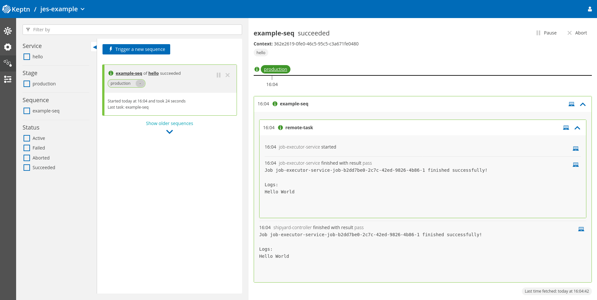

# Job Executor Service


[](https://goreportcard.com/report/github.com/keptn-contrib/job-executor-service)

This Keptn integration introduces a new approach of running customizable tasks with Keptn as Kubernetes Jobs.

## Motivation

The `job-executor-service` aims to tackle several current pain points with the current approach of services/integrations
running in the Keptn ecosystem:

| Problem                                                                                                                                                                                                                                                                                                                                        | Solution                                                                                                                                                                                                                                                                                                                                                                                                                                            |
|------------------------------------------------------------------------------------------------------------------------------------------------------------------------------------------------------------------------------------------------------------------------------------------------------------------------------------------------|-----------------------------------------------------------------------------------------------------------------------------------------------------------------------------------------------------------------------------------------------------------------------------------------------------------------------------------------------------------------------------------------------------------------------------------------------------|
| Keptn services are constantly running on Kubernetes while listening for Cloud Events coming in over NATS, even when idle. This consumes unnecessary resources on the Kubernetes cluster.                                                                                                                                                       | By running the defined Keptn tasks as short-lived workloads (Kubernetes Jobs), they just consume resources while the task is executed.                                                                                                                                                                                                                                                                                                              |
| Whenever some new functionality should be triggered by Keptn, a new Keptn service needs to be written. It usually wraps the functionality of the wanted framework and executes it under the hood. The downside: The code of the new Keptn service needs to be written and maintained. This effort scales linearly with the amount of services. | This service can execute any framework with just a few lines of yaml configuration. No need to write or maintain any new code.                                                                                                                                                                                                                                                                                                                      |
| Keptn services usually filter for a static list of events the trigger the included functionality. This is not configurable. Whenever the service should listen to a new event, the code of the service needs to be changed.                                                                                                                    | The Job Executor Service provides the means to trigger a task execution for any Keptn event. This is done by matching a jsonpath to the received event payload.                                                                                                                                                                                                                                                                                     |
| Keptn services are usually opinionated on how your framework execution looks like. E.g. the locust service just executes three different (statically named) files depending on the test strategy in the shipyard. It is not possible to write tests consisting of multiple files.                                                              | This service provides the possibility to write any specified file from the Keptn git repository into a mounted folder (`/keptn`) of the Kubernetes job. This is done by a initcontainer running before the specified image.                                                                                                                                                                                                                         |
| Support for new functionality in Keptn needs to be added to each Keptn service individually. E.g. the new secret functionality needs to be included into all of the services running in the Keptn execution plane. This slows down the availability of this new feature.                                                                       | The Job Executor Service is a single service which provides the means to run any workload orchestrated by Keptn. So, it is possible to support new functionality of Keptn just once in this service - and all workloads profit from it. E.g. in the case of the secret functionality, one just needs to support it in this service and suddenly all the triggered Kubernetes Jobs have the correct secrets attached to it as environment variables. |


## Compatibility Matrix

| Keptn Version | [Job-Executor-Service Docker Image](https://hub.docker.com/r/keptncontrib/job-executor-service/tags) | Config version |
|:-------------:|:----------------------------------------------------------------------------------------------------:|:--------------:|
|    0.10.0     |                               keptncontrib/job-executor-service:0.1.5                                |       v2       |
|    0.10.0     |                               keptncontrib/job-executor-service:0.1.6                                |       v2       |
|    0.12.2     |                               keptncontrib/job-executor-service:0.1.7                                |       v2       |
|    0.12.6     |                               keptncontrib/job-executor-service:0.1.8                                |       v2       |
|    0.13.x     |                               keptncontrib/job-executor-service:0.1.9                                |       v2       |
|    0.13.x     |                               keptncontrib/job-executor-service:0.2.0                                |       v2       |
|    0.14.x     |                               keptncontrib/job-executor-service:0.2.1                                |       v2       |
|    0.15.x     |                               keptncontrib/job-executor-service:0.2.2                                |       v2       |
|    0.16.x     |                               keptncontrib/job-executor-service:0.2.3                                |       v2       |

**Please Note**:
- Newer Keptn versions might be compatible, but compatibility has not been verified at the time of the release.
- If you are installing JES in the same namespace as Keptn, versions compatible with Keptn 0.14.x and newer will not be backward compatible due to a change in NATS cluster name
(see https://github.com/keptn/keptn/releases/tag/0.14.1 for more info about the breaking change).
- Job-Executor-Service version 0.2.2 and older are currently not compatible with Keptn 0.16.0 (caused by [keptn/keptn#8160](https://github.com/keptn/keptn/issues/8160))

**Warning**: We are aware that there might be a problem when trying to install Job-Executor-Service in the same namespace as Keptn 0.14.x. 
For now, we advise to install Job-Executor-Service in a separate namespace, and set `remoteControlPlane.api.hostname`, `remoteControlPlane.api.token`, ... as detailed in the
[Installation instructions](docs/INSTALL.md).


<details>
  <summary>Click here to show older versions</summary>
  
  | Keptn Version | [Job-Executor-Service Docker Image](https://hub.docker.com/r/keptncontrib/job-executor-service/tags) | Config version |
  |:-------------:|:----------------------------------------------------------------------------------------------------:|:--------------:|
  |     0.8.3     |                               keptncontrib/job-executor-service:0.1.0                                |       -        |
  |     0.8.3     |                               keptncontrib/job-executor-service:0.1.1                                |       -        |
  |     0.8.4     |                               keptncontrib/job-executor-service:0.1.2                                |       v1       |
  |     0.8.6     |                               keptncontrib/job-executor-service:0.1.3                                |       v2       |
  |     0.9.0     |                               keptncontrib/job-executor-service:0.1.4                                |       v2       |

</details>

## Quickstart

### Install job-executor-service
Install `job-executor-service` on a kubernetes cluster where `Keptn` is already installed:

```shell
JES_VERSION="0.2.3"
JES_NAMESPACE="keptn-jes"
TASK_SUBSCRIPTION="sh.keptn.event.remote-task.triggered" # Add the relevant events here in a comma-separated list

helm upgrade --install --create-namespace -n ${JES_NAMESPACE} \
  job-executor-service "https://github.com/keptn-contrib/job-executor-service/releases/download/${JES_VERSION}/job-executor-service-${JES_VERSION}.tgz" \
 --set remoteControlPlane.autoDetect.enabled="true",remoteControlPlane.topicSubscription="${TASK_SUBSCRIPTION}",remoteControlPlane.api.token="",remoteControlPlane.api.hostname="",remoteControlPlane.api.protocol=""
```
For more info about installing or upgrading `job-executor-service` please refer to the [installation instructions](docs/INSTALL.md)

### Create a simple "Hello World" job config
Create a simple project and service using the example [shipyard](docs/example/shipyard.yaml)
```shell
keptn create project jes-example -y -s docs/example/shipyard.yaml
keptn create service hello --project jes-example -y
```

Add a [simple "Hello world!" job config](docs/example/jobconfig.yaml) to `production` stage for service `hello` as `job/config.yaml`
```shell
keptn add-resource --project jes-example --service hello --stage production --resource docs/example/jobconfig.yaml --resourceUri job/config.yaml
```

Trigger the `example-seq` sequence. 
```shell
keptn trigger sequence --sequence example-seq --project jes-example --service hello --stage production
```

Have a look at the sequences for the project in Keptn bridge, it should look similar to the screenshot below:


For a more comprehensive list of use-cases and features that this integration supports have a look at [FEATURES.md](docs/FEATURES.md).

## Development

Development can be conducted using any GoLang compatible IDE/editor (e.g., Jetbrains GoLand, VSCode with Go plugins).

When writing code, it is recommended to follow the coding style suggested by the [Golang community](https://github.com/golang/go/wiki/CodeReviewComments).

### Common tasks

* Run tests: `go test -race -v ./...`
* Deploy the service during development using [Skaffold](https://skaffold.dev/):  
  `skaffold run --default-repo=<your-docker-registry> --tail`
(Note: replace `<your-docker-registry>` with your DockerHub username; The development deployment assumes that only one Keptn version is present on the cluster)
* Watch the deployment using `kubectl`: `kubectl -n keptn get deployment job-executor-service -o wide`
* Get logs using `kubectl`: `kubectl -n keptn logs deployment/job-executor-service -f`
* Watch the deployed pods using `kubectl`: `kubectl -n keptn get pods -l run=job-executor-service`

### How to release a new version of this service

It is assumed that the current development takes place in the `main` branch (either via Pull Requests or directly).

Creating a release is as simple as using the 
[Create pre-release](https://github.com/keptn-contrib/job-executor-service/actions/workflows/pre-release.yml) and 
[Create release](https://github.com/keptn-contrib/job-executor-service/actions/workflows/release.yml) workflows.

**Note**: Creating a pre-release will actually create a GitHub pre-release and tag the latest commit on the specified branch.
When creating a release, only a draft release as well as a pull request are created. You still need to publish the draft
release and merge the Pull Request.


## How to validate a job configuration

`job-lint` is a simple cli tool that validates any given job configuration file and shows possible errors. You can download it on the [GH Releases page](https://github.com/keptn-contrib/job-executor-service/releases).

```shell
./job-lint test-data/config.yaml

2021/07/13 16:18:49 config ../test-data/config.yaml is valid
```

*Note*: The default behavior when linting a job configuration is to not allow privileged job workloads.
This behavior can be changed by specifying `-allow-privileged-jobs=true`.
The flag should match the job-executor-service [configuration](/chart/README.md) to avoid problems during runtime.

## Features

A more comprehensive list of use-cases and features that this integration supports is provided in [FEATURES.md](docs/FEATURES.md).

## Architecture

A deep look into the architecture of job-executor-service is provided in [ARCHITECTURE.md](docs/ARCHITECTURE.md).

## Credits

The credits of this service heavily go to @thschue and @yeahservice who originally came up with this idea. :rocket:

## License

Please find more information in the [LICENSE](LICENSE) file.
