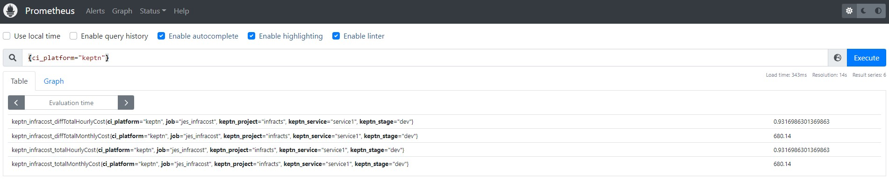

## Output Metrics

Often you will run an existing container / tool with the job executor service which outputs results. Most likely you want to use these metrics in a subsequent Keptn task (eg. a quality gate evaluation). To do so, you will need to push the metrics to a metric backend. This page demonstrates how this can be done.

- [Prometheus Integration](#output-metrics-to-prometheus)
- [Dynatrace Integration](#output-metrics-to-dynatrace)

Rather than directly running your container image, you'll need to wrap it in a "parent script" and run that parent script instead (shell scripts, python scripts, powershell scripts etc.).

The samples below assume you are using Python, but these instructions should provide enough information to adapt to any language you prefer.

### Output Metrics to Prometheus



Push metrics from any job executor service job to Prometheus using a [Prometheus Push Gateway](https://prometheus.io/docs/instrumenting/pushing/).

A Python base image with the requests module & the [prometheus client](https://pypi.org/project/prometheus-client/) is required.

You can use [gardnera/python:requests_prometheus_client](https://hub.docker.com/r/gardnera/python/tags) or build your own:
```
FROM python:slim
RUN pip install requests
RUN pip install prometheus-client
```

Use that image in your `job/config.yaml` file:
```
apiVersion: v2
actions:
  - name: "Run Your Tool"
    events:
      - name: "sh.keptn.event.YourEvent.triggered"
    tasks:
      - name: "Execute tool"
        files:
          - /files/app.py
        image: "gardnera/python:requests_prometheus_client"
        cmd: 
          - "python"
        args:
          - "/keptn/files/app.py"
```

Finally, create the `app.py` file using this boilerplate:

```
import json
import requests
from prometheus_client import CollectorRegistry, Counter, Gauge, push_to_gateway
import os

#####################
# Set these values  #
#####################

# The name of this integration. It will form part of the metric name. Eg. infracost
INTEGRATION_NAME = "infracost"

# Your Prometheus Push Gateway endpoint
# eg. "prometheus-pushgateway.monitoring.svc.cluster.local:9091"
PROM_GATEWAY = "prometheus-pushgateway.monitoring.svc.cluster.local:9091"

############################
# End configurable values  #
############################

# These variables are passed to job-executor-service automatically on job startup
# So you can assume they're available
KEPTN_PROJECT = os.getenv("KEPTN_PROJECT", "NULL")
KEPTN_SERVICE = os.getenv("KEPTN_SERVICE", "NULL")
KEPTN_STAGE = os.getenv("KEPTN_STAGE", "NULL")

PROM_LABELS = [
    "ci_platform",
    "keptn_project",
    "keptn_service",
    "keptn_stage"
]

########################
# Do your work here... #
########################

##########################
# PUSH METRICS TO PROM   #
##########################
reg = CollectorRegistry()

# pseudo-code for each metric
# create a new metric, set the labels and value
# this is just a sample, adjust based on your data structures
for metric_name in some_metrics:
  metric_value = some_metrics[name]

  # Create a Prometheus Gauge metric
  g = Gauge(name=f"keptn_{INTEGRATION_NAME}_{metric_name}", documentation='', registry=reg, labelnames=PROM_LABELS)
  # Set the labels and values
  g.labels(
    ci_platform="keptn",
    keptn_project=KEPTN_PROJECT,
    keptn_service=KEPTN_SERVICE,
    keptn_stage=KEPTN_STAGE
  ).set(metric_value)

# Send the metrics to Prometheus Push Gateway
push_to_gateway(gateway=PROM_GATEWAY,job=f"job-executor-service", registry=reg)
```

## Output Metrics to Dynatrace

Coming soon...